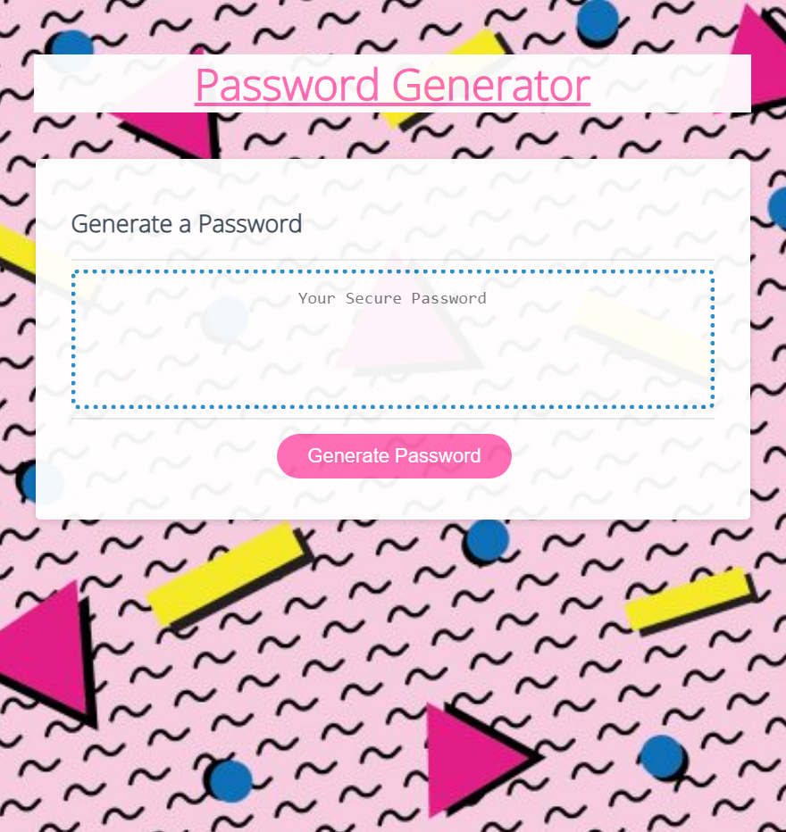

# 03 JavaScript: Password Generator Challenge

## by Sophia De La Rosa

Created a random password generator based on certain criteria input by the user. This generator uses a function to generate a random number which is used to select characters in dataset strings. Each dataset string is only included if the user confirms the criteria. The new randomized password is then returned to the textbox on the page. 

## Mock-Up

The following image shows the web application's appearance and functionality:

